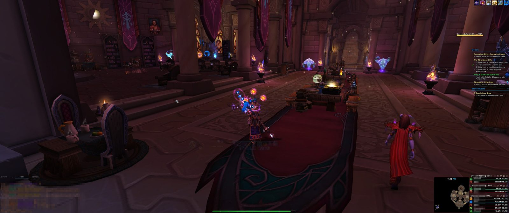
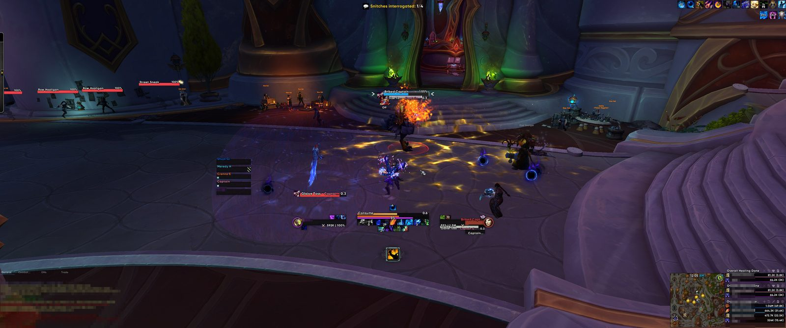
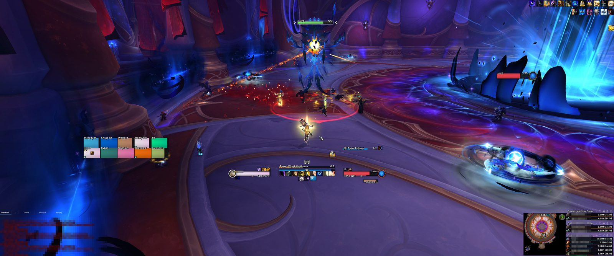

<div align="center">

<a href="https://yuno.wtf">
  
</a>

<p>An EllesmereUI-based World of Warcraft user interface.</p>

<p>
  <a href="https://yuno.wtf">yuno.wtf</a>
  ·
  <a href="https://github.com/yunodu/yunoui/releases/latest">Download</a>
  ·
  <a href="https://www.curseforge.com/wow/addons/yuno">CurseForge</a>
  ·
  <a href="yuno/CHANGELOG.md">Changelog</a>
</p>

<p></p>
<p></p>
<p></p>

</div>

yuno is the installer, profiles, and extras on top of [EllesmereUI](https://www.curseforge.com/wow/addons/ellesmereui). It imports 16:9 and 21:9 layouts, player and target portraits, frame shadows, and the supporting profiles for BigWigs, EXBoss, sArena, and Baganator.

Setup and downloads live on **[yuno.wtf](https://yuno.wtf)**. This repo is the addon.

## Install

**5.0 is a full reinstall.** Delete the contents of your current `Interface\AddOns\yuno` folder and reimport the WowUp string. Updating over 4.x will leave you with mixed profiles.

1. In [WowUp](https://wowup.io/), open **My Addons → Import** and paste the string from [yuno.wtf/install](https://yuno.wtf/install).
2. Restart World of Warcraft and log in. The installer opens, picks 16:9 or 21:9 from your monitor, and imports both layouts.

If it does not open:

```
/yuno install
```

No WowUp? Grab [yuno.zip](https://github.com/yunodu/yunoui/releases/latest/download/yuno.zip) or install from [CurseForge](https://www.curseforge.com/wow/addons/yuno). Those are yuno only — EllesmereUI and the rest still have to be installed separately. A [video guide](https://www.youtube.com/watch?v=W4Ub_4-39Xk) covers the full setup.

## What it does

- **Layouts** — Bundled EllesmereUI profiles for 16:9 and 21:9. The installer imports both; switch later with `/yuno layout 16` or `/yuno layout 21`.
- **Portraits** — Player and target portraits are built in. Blinkii's Portraits is not required.
- **Appearance** — Dark or class coloring, health opacity, class-background tint, chat button side, and drop shadows on unit frames, resource bars, and the cooldown manager.
- **Profiles** — Imports for BigWigs (including boss options and a yuno countdown voice), EXBoss, sArena Reloaded, Baganator, and Cooldown Manager.
- **Healing** — A healing profile that activates on healer specs.

Required: **EllesmereUI** and **yuno**. Optional, but what the installer styles: BigWigs / LittleWigs, EXBoss, sArena Reloaded, Baganator.

## Commands

| Command | |
| --- | --- |
| `/yuno` | Settings |
| `/yuno install` | Run the installer |
| `/yuno layout 16` / `21` | Switch the active EllesmereUI layout |
| `/yuno appearance dark` / `class` | Frame coloring |
| `/yuno shadows on` / `off` | Frame shadows |
| `/yuno help` | Full command list |
